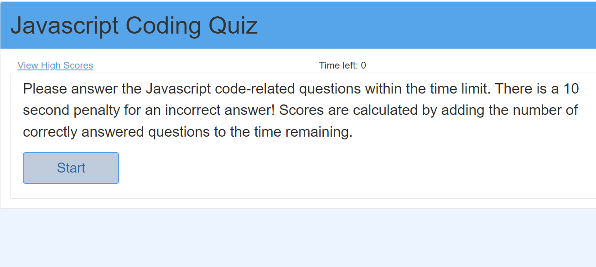

 # Javascript Quiz

  

 ## Table of Contents
 * [Project description](#Description)
 - [Usage](#Usage)
 - [License](#License)
 - [Contributing](#Contributing)
 - [Questions](#Questions)

 ## Description
This application is a timed Javascript coding quiz that allow users to test their knowledge.  The quiz is in multiple-choice 
format and is timed.  A time penalty is applied for each incorrect answer then the final score is calculated by adding the 
remaining time to the number of  correct answers.   The application is written with Javascript, HTMl and styled wit CSS.
 
 
 
  ## Usage
 The Javascript Quiz is deployed on Github and can be accessed by visiting:
 
 `https://ogoines.github.io/Javascript-Quiz/`
 
 ## License
 GPL 3.0

 This project is licensed by the GPL 3.0.
 
 ## Contributing
 Currenty, there are no guidelines for contributions

## Questions

 Contact me with additional questions at 

 Orsha Goines at orshamarie@email.com or check out my work on GitHub at 

 [GitHub](https://github.com/[ogoines]
 